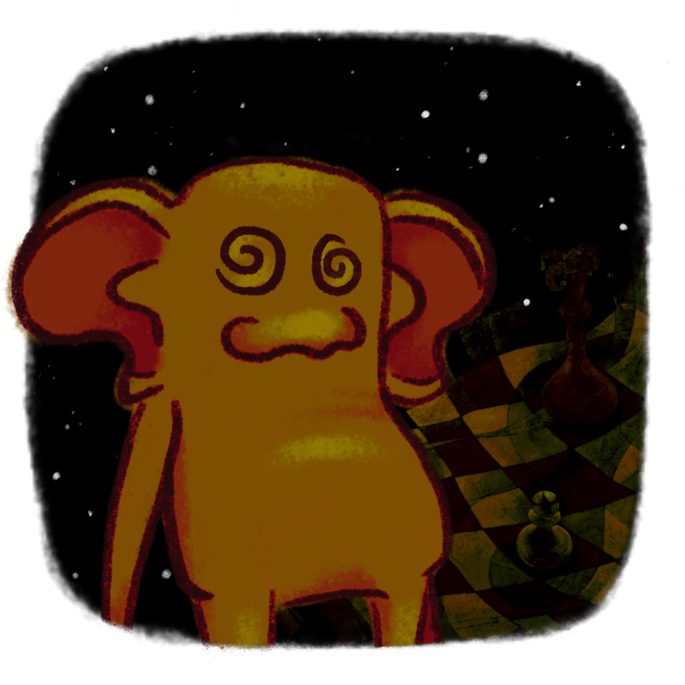

#  Milo
A 2D point-and-click adventure puzzle game designed to target the issue of repetitiveness.  
This game was developed for a Final Year Project in the 3rd year of studying BSc Computer Science at Queen Mary University of London.

## How to open the project (in Unity)?
1. Make sure Unity is downloaded.
2. Install the suitable editor version for this game (**2023.1.15f1**).
3. Pull the repository to your local machine.
4. Inside Unity Hub click **Open -> Open Project from Disk** and select the downloaded project folder.

## How to play the game (in Unity)?
1. In Unity Editor within the open project navigate to **Assets -> Scenes** and select and open the **StartScreen** scene.
2. In the top bar of the **Game Window** change the resolution from "Free Aspect" to **"Full HD"**
3. Click on the play icon above and the game should start running in the Game Window.

## Alternatively the game can be played by downloading a build version.
#### [Windows Intel-64 version](https://drive.google.com/drive/folders/1v2DwOg74mJv3eWAvRrYVXQEKf6qBQlr7?usp=drive_link)
#### [MacOS version](https://drive.google.com/drive/folders/1uagEVeiQDAQEDuL1wYkSsSMLUpDmLIeC?usp=share_link)

1. Download the folder to your local machine and unzip it.
2. Open the **Milo.exe** file to start the game.

> [!WARNING]
> - In MacOS version the colliders around scenes are not detecting collisions properly. Please keep the player within rooms at all times.
> - In any case if a **red arrow** appears inside the closed doors in the initial scene please close the window and open the game again. This will result in bugs in further gameplay.

## Basic controls
- The character can be controlled using WASD/arrow keys.
- All other actions are point-and-click-based and a breakdown can be seen below:

## Resources
All the sounds used in the game were downloaded from [**freesound.org**](freesound.org)
 
Icons used for the UI were downloaded from [**icons8.com**](https://icons8.com/icons/quill)
